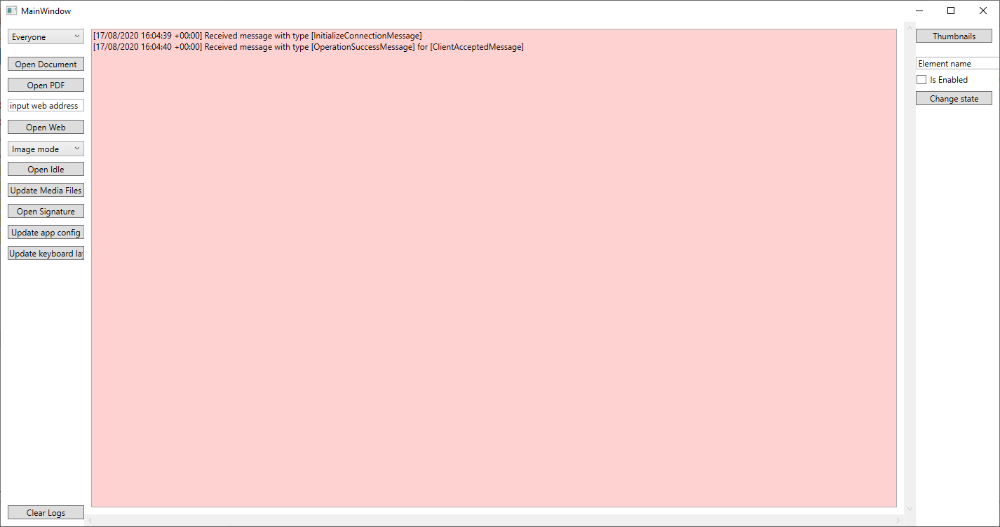
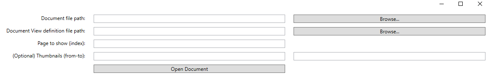
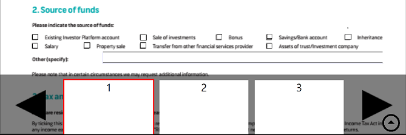
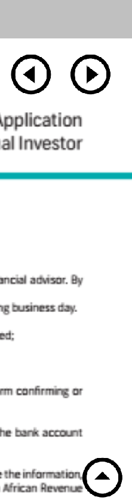
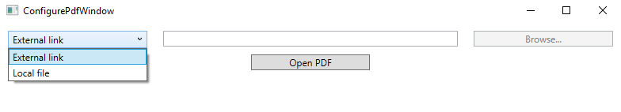
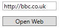
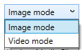

# Getting Started 

## Development Environment

The sample application is supplied for Windows 10 and above to demonstrate using the SDK.
Microsoft Visual Studio 2019 is required to build the sample code.

A Wacom display tablet such as DTU-1141 must be installed to use the application. This must appear as a separate display in Windows Display Settings. 


## Install the Kiosk Server

The Kiosk Server is supplied in an msi installer in the Tray Application folder.
Run the installer to install the application in ```Program Files (x86)\Wacom Ink SDK for Multi-Display```

The Tray App ```Wacom.Kiosk.App.exe``` runs on user login or can be started manually from the Windows Start menu if necessary: 
```Wacom Ink SDK for Multi-Display```

On startup the Kiosk Server displays the default slideshow configured for Idle mode. 

## License the application

Before running the Control Application a kiosk license must be installed.
The license is supplied separately as a JWT license string. Paste this into the Sample Code license file: ```App.config```  
i.e. replace the string in the tag:  
<add key="license" value="PASTE YOUR KEY HERE"/>


----
## Sample Code

Build the sample code by following these steps:
- open the project file ```Wacom.Kiosk.IntegratorUI.csproj```
- in the first build update the NuGet package as follows:
    - select *Manage NuGet Packages...* (right click the solution project to display the menu)
    - select Settings (click the gearwheel icon)
    - select or Add the package source 'kiosk' (to add the package click the + button)
    - browse to the SDK folder containing ```Wacom.Kiosk.SDK.nupkg``` (use the ... button)
    - select Update
    - locate Wacom.Kiosk.SDK in the Installed  packages list and install or update as required
- In Visual Studio select Debug, Any CPU  
- Build Solution

Run the control application.
On startup the window display will appear. The received message display indicates a successful connection to the server:



The following sections describe the commands

### Everyone

The drop-down selects the option to send Kiosk control messages as broadcast messages or to a specific server, identified by a GUID.
The presence of a GUID in the drop-down indicates a successful connection to the Kiosk server.

### Open Document

The "Open Document" option in the Kiosk Sample App allows you to display a chosen PDF document on the pen display and scroll through it.  

In order to open a document you must first select valid parameters on the dialog window shown below. 

 

For example:
 

The default location for the documents is:

```.../Sample App/Resources/documents```

The parameter selections are defined as follows:

- Document file path: full path to the PDF document to be opened
- Document View definition file path: full path to the XAML definition file which determines how and where the command buttons should be displayed
- Page to show (index): Page number to display
- (Optional) thumbnails (from-to): Thumbnail values indicating the start and end points of the document to be displayed

The sample app is supplied with four document definition files as follows:  

- DocumentViewLeftPanel.xaml - command icons are displayed in a separate panel on the left-hand side of the pen tablet
- DocumentViewTopPanel.xaml  - command icons are displayed in a panel at the top of the pen tablet
- DocumentViewTopBottomPanels.xaml - the Accept and Reject icons are displayed along the bottom of the tablet, the others at the top
- DocumentViewSuperImposedButtons.xaml - command icons are super-imposed over the document content

The positioning of the command buttons depends on the contents of the XAML definition file which is selected.  

Here is a sample button definition taken from DocumentViewLeftpanel.xaml:

```
<Button x:Name="OpenMirroring" Width="100" Height="100" BorderThickness="0" Margin="25,25,0,0" VerticalAlignment="Top" HorizontalAlignment="Left">
		<Button.Background>
				<ImageBrush ImageSource="openmirroring.png"/>
		</Button.Background>
</Button>
```

The properties of the \<Button\> definitions specify various aspects of how the buttons (or icons) are displayed:

- **ImageSource**: the name of an image file containing the image to be displayed on the button
- **Width** and **Height**: size of the button in pixels. Note that the buttons should not be wider than the grid which contains them.
- **BorderThickness**: pixel thickness of the border around the button
- **Margin**: number of pixels to be left as a margin around each side of the button. The four values are for the left, right, top and bottom sides of the button respectively.  
- **HorizontalAlignment**: the horizontal alignment of the button within the surrounding grid. For example, if the surrounding grid is 300 pixels wide and each button is 150 pixels wide and horizontally aligned to the right then it will be aligned to the right-hand side of the surrounding (but actually invisible) grid.  

Here is an example of the command buttons as displayed when using the "Top Panel" option:


The command icons enable the following functionality, in the order shown in the screenshot above:

- Enable mirroring
- Disable mirroring
- Zoom in and out
- Move quickly up or down the page
- Move to a specific page using thumbnails
- Accept document
- Reject document

On clicking the thumbnails icon a panel is displayed at the bottom of the pen tablet as illustrated below.  
It is then possible to move directly to a specific page number by clicking on it.  
The left and right arrows are provided for documents where there are lots of pages to browse through.  

  

Additionally arrow buttons are overlaid on the document itself as illustrated below.  
They are used to move the previous or next page or scroll to the top.  



### Open PDF

The "Open PDF" option in the Kiosk Sample App allows you to open an existing PDF document and scroll through it on the pen display.  
There are two options - "External link" and "Local file" - as illustrated below:

  

* **External link**: allows you to open a PDF from a valid URL address which must be entered manually in the field provided  

* **Local file**: enables you to browse through and open a PDF from your local PC file system  

### Open Web

The "Open Web" option in the Kiosk Sample App allows you to open a Web site and scroll through it on the pen display.  
You must first enter the URL of the Web site in the field directly above the "Open Web" button as illustrated below.  

  

### Open Idle

The "Open Idle" option in the Kiosk Sample App allows you to start a slide show or video on the pen display.  
There are two options - "Image mode" and "Video mode" - which are provided in the drop-down list immediately above the "Open Idle" button. 
Note that when the drop-down list is activated it completely obscures the "Open Idle" button as illustrated below.

  

The default locations for the images and videos are:

Images: ```.../Sample App/Resources/media/images/default```
Videos: ```.../Sample App/Resources/media/videos/default```


----
----


