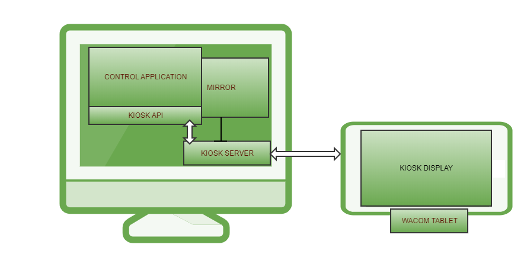

# Wacom Ink SDK for Kiosk

**NOTICE:**

All of the content provided in this repository is **classified as Wacom Confidential Material**, therefore the signed NON-DISCLOSURE AGREEMENT applies.
Be aware that the **technology components are still under active development** with minimal QA testing, and **API interfaces and functionality could be changed or removed**.

---

## Introduction

Use the Wacom Ink SDK for Kiosk to present an application on a Wacom tablet isolated from standard Windows controls:

The SDK allows an application to use the tablet display and pen input independently of the Windows mouse. Additional functions include:
* screen mirroring
* display of advertising content during idle mode

The diagram shows the main components of a Kiosk application:
* Kiosk Server - the server is installed in the Windows system tray and processes input and output to the tablet 
* Control Application - the client application issues commands to the Kiosk server through the Kiosk API
* Kiosk display - the display content is supplied by the Kiosk server, content can include user controls activated by the tablet pen
* Mirror - optionally the Kiosk server will reproduce the contents of the tablet display in a window 

## Overview

### Kiosk Server

The Kiosk Server is installed as a Windows tray application and communicates via messages with the Control application to perform tasks on the Kiosk display tablet.
The server consists of a set of DLLs which provide an interface to the tablet display and pen input.

The server manages tablet functions such as:
* videos
* picture slideshows
* scaling of images for the connected Wacom tablet
* application configuration
* view configuration
* screen mirroring
* web browsing
* document reading and editing
* signature functionality with metadata for documents and other pieces of information
* signature metadata available in alternative encoding
* Signature graphics 
* form field input including text input from virtual keyboard
* user interface control buttons

In its idle mode, the Kiosk server uses configuration data to display images or video on the Kiosk display.
Default configuration file settings can be overridden dynamically by the Control application, for example the supply of alternative idle display images or video.
The server communicates with the tablet through the Wacom driver installed for the device.

### Control Application

The Control application is developed by the system integrator.
The application communicates with the Kiosk server through the Kiosk API and provides the business logic for the application.
Typically the application will supply image data for the Kiosk display and respond to a user's pen input.
The Kiosk server supplies pen data as messages to be handled by the application.

### Kiosk API

The Kiosk API is accessed through a .NET NuGet package. 

The API includes support for:

* TCP messaging between the Control application and Kiosk server
* PDF utilities used to parse PDF files into discrete objects 
* JSON configurations used to define the different modes of operation

Messages exchanged between the Control application and Kiosk server are used to switch between different tablet modes, retrieve input data and render specific data on the Kiosk display.

### Kiosk Display

The Wacom tablet is treated as a separate Windows monitor and controlled by the Kiosk server to support:
* image display
* pen input
* mouse control - the mouse cursor is prevented from entering the display area

---

## Feedback / Support
Participants of the Wacom Beta Program will be provided with optional access to our Slack channel: 

If you experience issues with the technology components, please file a ticket in our Developer Support Portal:

- [Developer Support Portal](https://developer.wacom.com/developer-dashboard/support)

## Technology Usage
**No Commercial Use**. NOTWITHSTANDING ANYTHING TO THE CONTRARY, THIS AGREEMENT DOES NOT CONVEY ANY LICENSE TO USE THE EVALUATION MATERIALS IN PRODUCTION, OR TO DISTRIBUTE THE EVALUATION MATERIALS TO ANY THIRD PARTY. THE PARTNER ARE REQUIRED TO EXECUTE A SEPARATE LICENSE AGREEMENT WITH WACOM BEFORE MANUFACTURING OR DISTRIBUTING THE EVALUATION MATERIALS OR ANY PRODUCTS THAT CONTAIN THE EVALUATION MATERIALS. The Partner hereby acknowledge and agree that: (i) any use by The Partner of the Evaluation Materials in production, or any other distribution of the Evaluation Materials is a material breach of this Agreement; and (ii) any such unauthorized use or distribution will be at The Partner sole risk. No such unauthorized use or distribution shall impose any liability on Wacom, or any of its licensors, whether by implication, by estoppel, through course of dealing, or otherwise. The Partner hereby agree to indemnify Wacom, its affiliates and licensors against any and all claims, losses, and damages based on The Partner use or distribution of the Evaluation Materials in breach of this Agreement.

